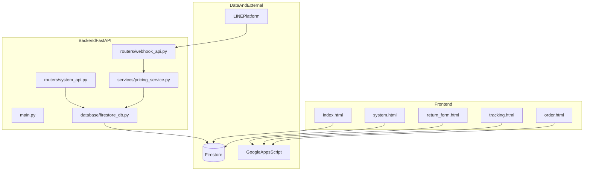

# 架構說明

此文件補充 `README.md`，聚焦於資料流、責任邊界與主要風險點。

## 系統分層

## 後端職責

- `main.py`
  - 掛載路由與生命周期
  - 啟動時執行全量快取載入
- `database/firestore_db.py`
  - 維護記憶體商品快取
  - 以 Firestore `Products` 為來源
- `services/pricing_service.py`
  - 查詢解析、搜尋策略、階梯報價
- `routers/webhook_api.py`
  - LINE Webhook 驗簽與訊息回覆
- `routers/system_api.py`
  - 刷新快取與快取統計接口

## 前端職責（查價系統）

- `js/app.js`：整體入口與事件綁定
- `js/state.js`：集中管理共享狀態（商品、報價、權限）
- `js/search.js`：搜尋與排序
- `js/render.js`：搜尋結果渲染
- `js/quote.js`：報價清單操作
- `js/export.js`：匯出能力（Excel/PPT）
- `js/import.js`：商品匯入與同步

## 主要資料流

### A. 網頁查價

1. 使用者在 `system.html` 登入
2. 前端從 Firestore 讀取資料，寫入前端狀態
3. 使用者搜尋與編輯報價清單
4. 匯出成 Excel/PPT 或查詢歷史

### B. LINE 查價

1. LINE 平台呼叫 `/api/webhook`
2. 後端解析訊息條件（數量、預算、關鍵字）
3. 由快取進行商品搜尋與價格計算
4. 回傳 Flex Message

### C. 快取刷新

1. 管理者呼叫 `/api/refresh?token=...`
2. 後端重新從 Firestore 全量載入
3. 記憶體快取原子替換（避免半成品）

## 風險與維運重點

- 前端直連 Firestore：安全規則與權限邏輯需特別嚴格
- 多技術混合：原生 JS 與 React CDN 並存，維護風格需一致
- 已將查價頁收斂為單一路徑，`system-v2/system.html` 僅保留轉址相容入口
- 關鍵整合點依賴外部服務：LINE、GAS、Firestore

## 演進建議

- 收斂資料寫入入口到後端 API
- 引入前端建置工具與基本測試框架
- 為 `pricing_service.py` 與 `parser.py` 建立單元測試
- 維持單一路徑部署與驗收流程，避免雙版本回歸
